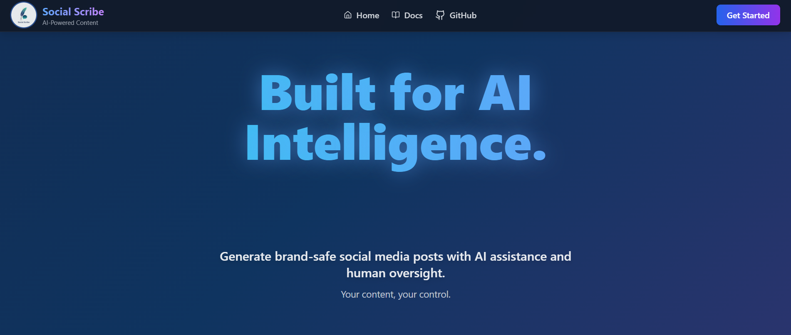
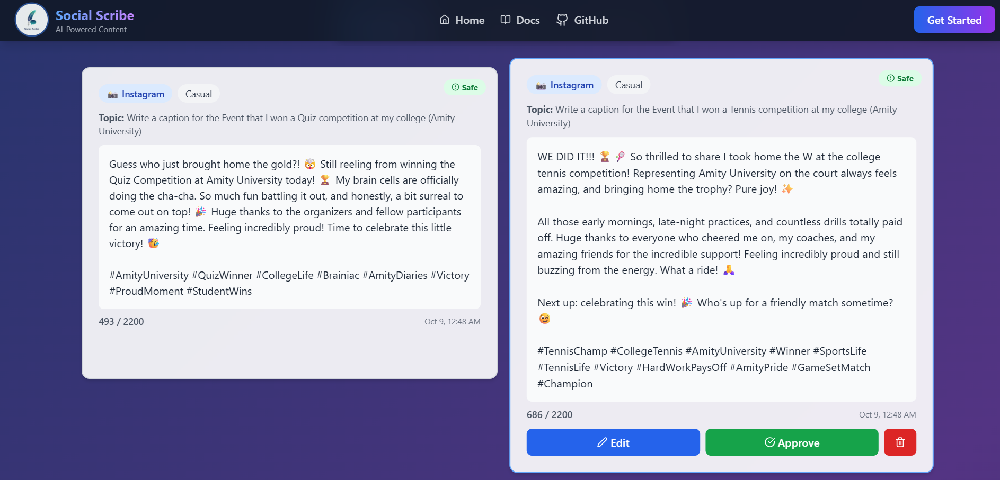
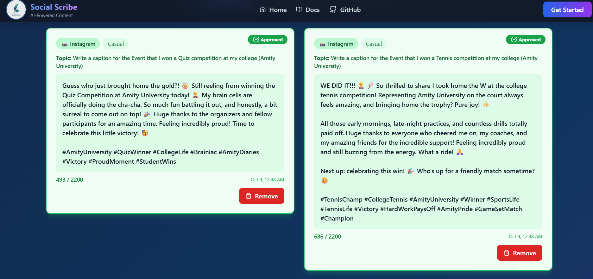

<div align="center">
  
  # 🪶 Social Scribe
  
  ### AI-Powered Social Media Content Generator with Human-in-the-Loop Control
  
  [](https://social-scribe-deployed.vercel.app/)
  [](LICENSE)
  [](https://reactjs.org/)
  [](https://nodejs.org/)
  
  [🚀 Live Demo](https://social-scribe-deployed.vercel.app/) • [📖 Documentation](#-installation) • [✨ Features](#-features)
  
</div>

---

## 📸 Screenshots

<div align="center">
  
  ### Desktop View
  
  
  ### Mobile View
  
  
  ### Draft Management
  
  
  ### Approval Workflow
  
  
</div>

---

## 🎯 What is Social Scribe?

**Social Scribe** is an intelligent social media content generator that combines Google's Gemini AI with human oversight. Create platform-optimized posts for Twitter, LinkedIn, Instagram, and Facebook while maintaining complete control over what gets published.

### ✨ Key Features

- 🤖 **AI-Powered** - Leverages Google Gemini 2.5 Flash for smart content generation
- 👥 **Human-in-the-Loop** - Every post requires approval before publishing
- 🎨 **Multi-Platform** - Optimized for Twitter, LinkedIn, Instagram, Facebook
- 🎭 **Multiple Tones** - Professional, Casual, Playful, Inspirational
- ⚡ **Real-time** - Instant generation and management
- 📱 **Responsive** - Works seamlessly on all devices
- 🔒 **Brand Safe** - Built-in safety checks and validation

---

## 🏗️ Tech Stack

**Frontend**
- React 18 + Vite
- Tailwind CSS
- GSAP Animations
- Axios + React Router

**Backend**
- Node.js + Express
- MongoDB Atlas
- Google Gemini AI
- Mongoose ODM

**Deployment**
- Frontend: Vercel
- Backend: Render
- Database: MongoDB Atlas

---

## 🚀 Quick Start

### Prerequisites

- Node.js 18+
- MongoDB Atlas account
- Google AI Studio API key

### Installation

1. **Clone the repository**
```
git clone https://github.com/Nabin-09/SocialScribe.git
cd SocialScribe
```

2. **Backend Setup**
```
cd backend
npm install
```

Create `.env`:
```
MONGODB_URI=your_mongodb_connection_string
GEMINI_API_KEY=your_gemini_api_key
PORT=5000
```

Start server:
```
npm run dev
```

3. **Frontend Setup**
```
cd ../frontend
npm install
```

Create `.env`:
```
VITE_API_URL=http://localhost:5000/api
```

Start app:
```
npm run dev
```

Visit `http://localhost:5173` 🎉

---

## 🔑 Get API Keys

**MongoDB Atlas**: [mongodb.com/cloud/atlas](https://www.mongodb.com/cloud/atlas)
- Create free cluster → Get connection string

**Google Gemini**: [aistudio.google.com/app/apikey](https://aistudio.google.com/app/apikey)
- Sign in → Create API key

---

## 📚 API Endpoints

| Method | Endpoint | Description |
|--------|----------|-------------|
| POST | `/api/generate` | Generate new post |
| GET | `/api/posts` | Get all posts |
| PUT | `/api/posts/:id` | Update post |
| DELETE | `/api/posts/:id` | Delete post |

---

## 🎨 Features

### Content Generation
- Platform-specific character limits
- Tone customization
- Custom constraints (hashtags, mentions)
- AI model fallback system

### Management
- Draft/Approve workflow
- Edit before publishing
- Filter by status (All/Approved/Pending)
- Real-time character counting

### Platform Support

| Platform | Limit | Special Features |
|----------|-------|------------------|
| Twitter | 280 | Hashtag optimization |
| LinkedIn | 3,000 | Professional formatting |
| Instagram | 2,200 | Emoji-rich content |
| Facebook | 63,206 | Long-form posts |

---

## 📁 Project Structure

```
SocialScribe/
├── frontend/
│   ├── src/
│   │   ├── components/      # UI components
│   │   ├── pages/           # Route pages
│   │   ├── services/        # API calls
│   │   └── assets/          # Images, styles
│   └── package.json
│
├── backend/
│   ├── config/              # DB & AI config
│   ├── models/              # MongoDB schemas
│   ├── controllers/         # Route handlers
│   ├── services/            # Business logic
│   ├── middleware/          # Validation & errors
│   ├── routes/              # API routes
│   └── server.js            # Entry point
│
└── README.md
```

---

## 🚀 Deployment

**Frontend (Vercel)**
1. Connect GitHub repo
2. Set `VITE_API_URL` environment variable
3. Deploy

**Backend (Render)**
1. Create web service
2. Add environment variables
3. Set build: `npm install`, start: `npm start`
4. Deploy

---

## 🤝 Contributing

Contributions welcome! Please:
1. Fork the repo
2. Create feature branch (`git checkout -b feature/AmazingFeature`)
3. Commit changes (`git commit -m 'Add AmazingFeature'`)
4. Push to branch (`git push origin feature/AmazingFeature`)
5. Open Pull Request

---

## 📝 License

MIT License - see [LICENSE](LICENSE) file

---

## 👨‍💻 Author

**Nabin Sharma**

- GitHub: [@Nabin-09](https://github.com/Nabin-09)
- Email: sharmanabin.0910@gmail.com

---

## 🙏 Acknowledgments

- [Google Gemini AI](https://ai.google.dev/)
- [MongoDB Atlas](https://www.mongodb.com/cloud/atlas)
- [Vercel](https://vercel.com)
- [Render](https://render.com)

---

<div align="center">
  
  ### ⭐ Star this repo if you found it helpful!
  
  Made with ❤️ by Nabin Sharma
  
</div>
